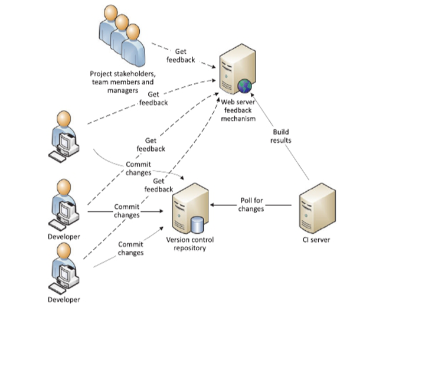

# continuous-integration
Book about continuous-integration

# Continuous Integration (CI)

## Introduction

Some people like to work on the same project and face some problems:

- After a merge the project is not building anymore due to
  * Version conflicts
  * Merge conflicts
  * Different development environments

 - After a merge some of my tests are failing
   * Other developers did not run my tests
 
- The code of the other developer look pretty ugly
  * No or different coding standards
 
 A solution to prevent such problems is to invent some kind of automatism like a server which is running some standard tasks like
 - Static code analysis
 - Unit/integration tests
 - Build
 

 A CI server can take over such tasks.